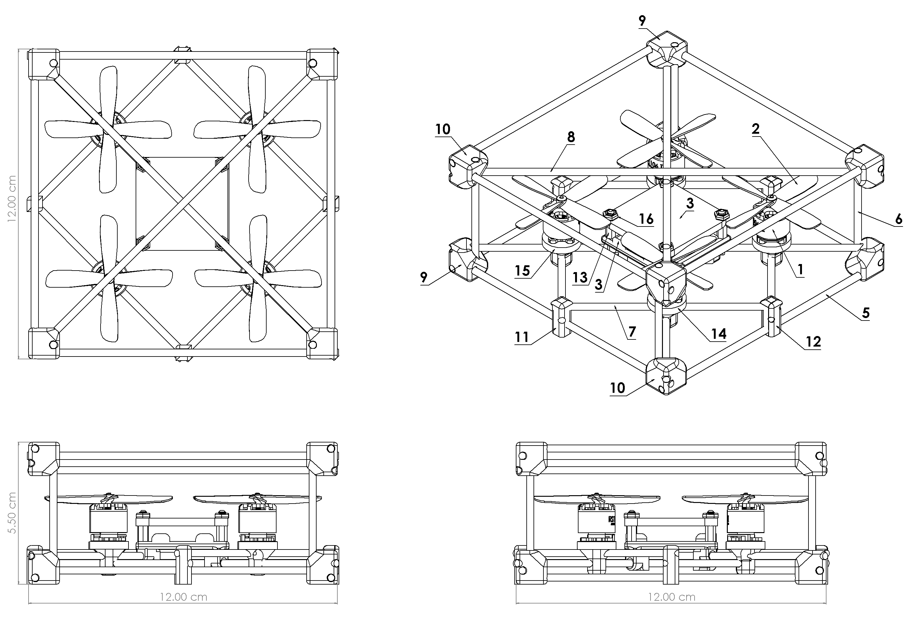
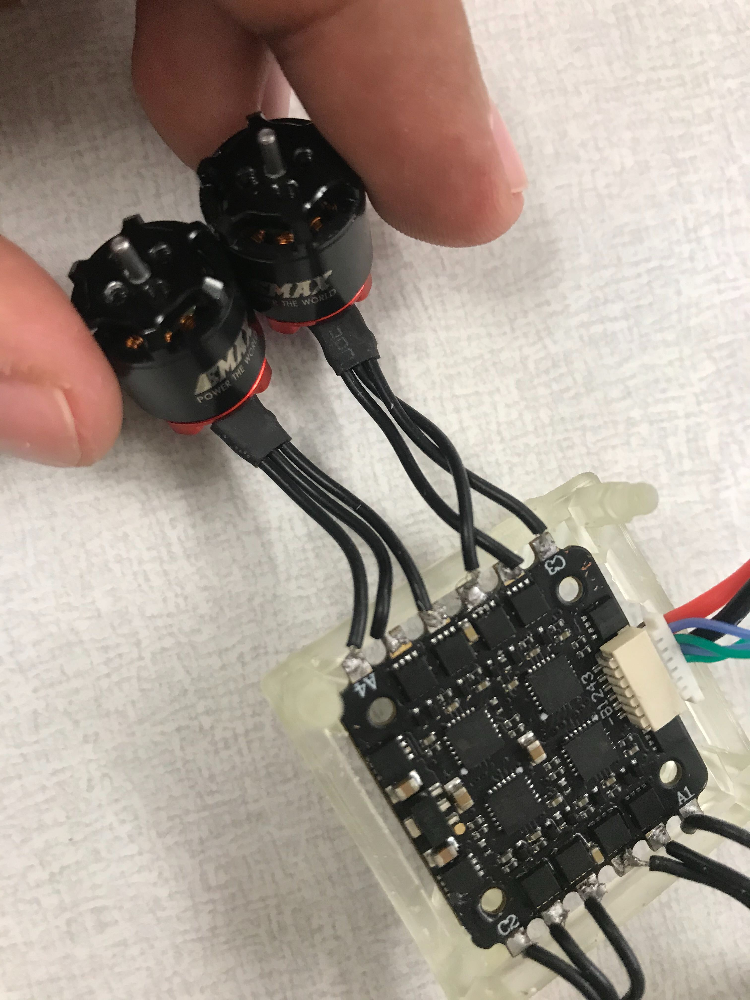
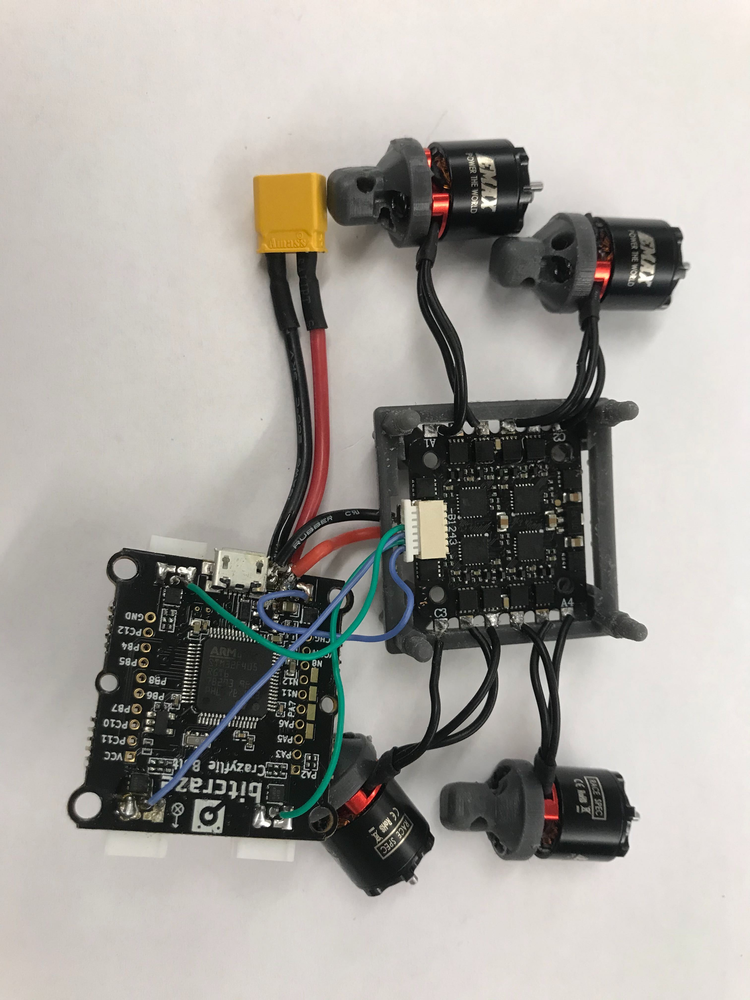
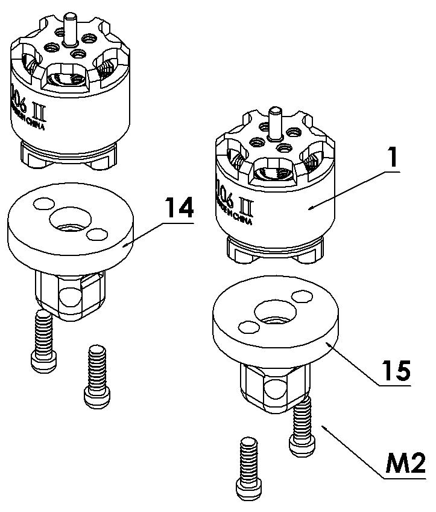
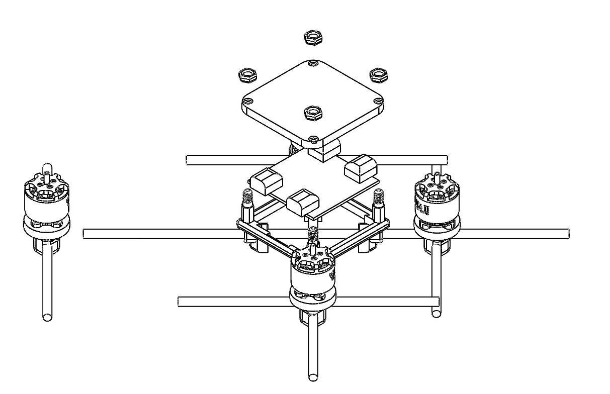

.. _Quadrotor design:

################
Quadrotor design
################

.. figure:: images/quadrotor.JPG
    :align: center
    :figwidth: 300px

Structure
-------

* Motor
    - 4 x EMAX RS1108 - 5200KV 
* Propeller
    - 4 x EMAX avan Quad-Blade 2 inch 
* Electronic Speed Control(ESC)
    - 1 x AKK 20(Amp) 4 in 1 BLHeli 2S–4S 
* Mainboard 
    - 1 x CrazyBolt
* Carbon Rods
    - 8 x side  (12cm)
    - 4 x carbon rods (Decide by you)
    - 4 x inner square carbon rods (8.5cm)
    - 4 x diagonal carbon rods (17cm)
* 3D Printer Units
    - 4 x corner_1 [Flexible_]
    - 4 x corner_2 [Flexible_]
    - 2 x inner_square_1 [Durable_]
    - 2 x inner_square_2 [Durable_]
    - 1 x core_frame [Durable_]
    - 2 x CCW motor mount [Durable_]
    - 2 x CW motor mount [Durable_]
* Nut
    - 4 x 3 mm
.. _Flexible: https://formlabs.com/materials/flexible-elastic 
.. _Durable: https://formlabs.com/materials/tough-durable/ 

Assemble step by step
======================
Step 1 - Solder ESC, Motors and Crazyflie
-----------------------------------------

Notes: A4 and A1 are symmetric and C3 and C2 are symmetric based on the image.

Step 2 - Assemble the Motor Mounts
----------------------------------

Step 3 - Assemble the Carbon Rods with 3D printer Units
--------

