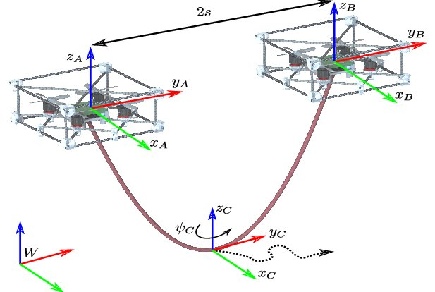

.. _Theory:

###############
Catenary theory
###############

Catenary Robot
-----------------

A catenary robot or flying
catenary is a mechanical system composed of a cable with
two quadrotors attached to its ends. Note that when the cable
is hanging from the two quadrotors and there are no objects
colliding with the cable, this naturally adopts a catenary curve
form. The cable is flexible and non-stretchable.

