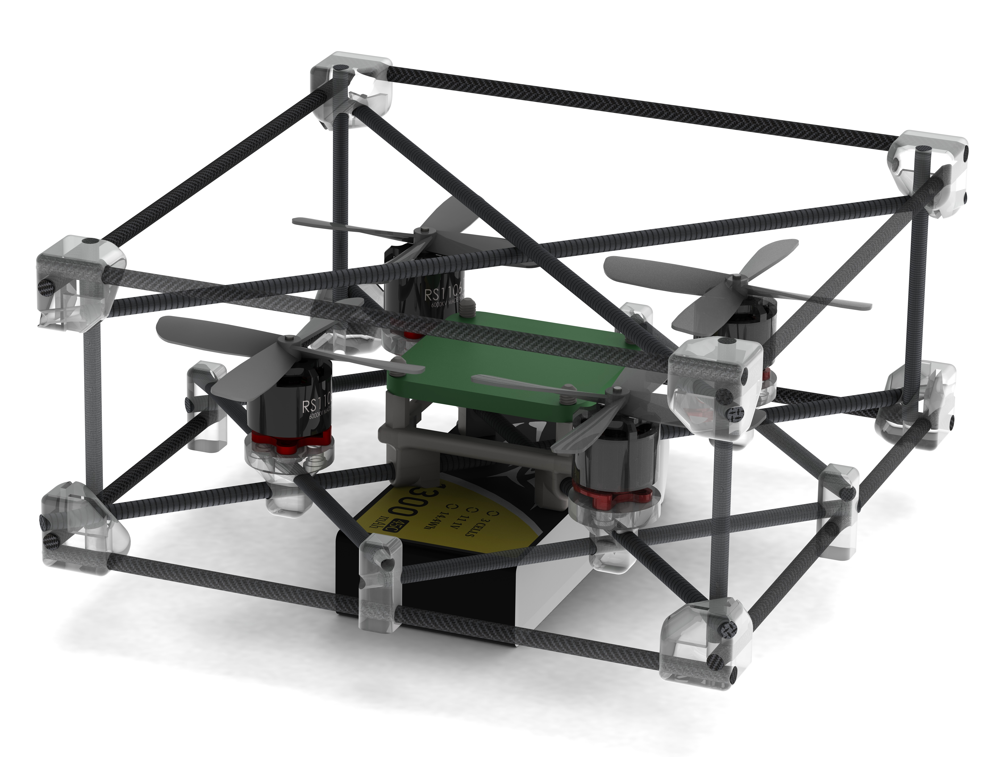

Documentation quad!
=======================================

Here you can find the 3D model

.. toctree::
   :caption: Drone assemble
   :name: sec-assemble
   :maxdepth: 1

    Quadrotor design    <assemble/design>
    Mathematical model  <assemble/model>

.. toctree::
   :caption: The Catenary Robot
   :name: sec-catenary_robot
   :maxdepth: 1

    Introduction                    <catenary_robot/introduction>
    Theory                          <catenary_robot/theory>
    MATLAB simuator                 <catenary_robot/matlab>
    Coppelia Simulator              <catenary_robot/coppelia>
    Experiments and implementation  <catenary_robot/experimentsandimpl>

.. toctree::
   :caption: H-ModQuad
   :name: sec-hmodquad
   :maxdepth: 1

    Intro                          <h-modquad/introduction>
    Development                    <h-modquad/development>

Indices and tables
------------------

* :ref:`genindex`
* :ref:`modindex`
* :ref:`search`